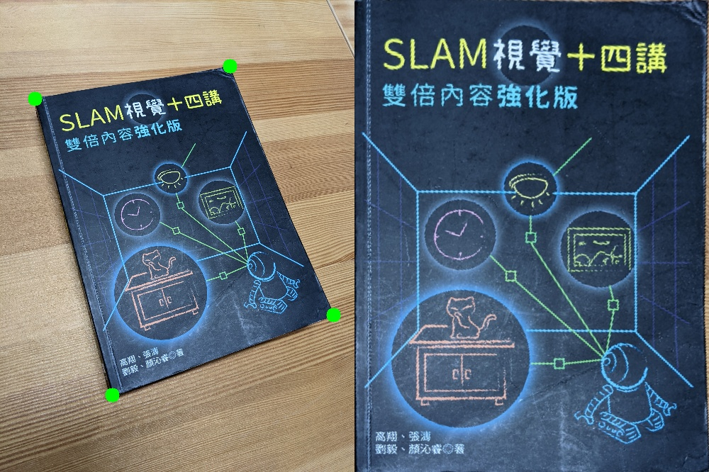

# 3D Computer Vision

Several 3D computer vision algorithm. Core modules are implemented without using OpenCV library.
This project is from [NTU 3D Computer Vision class assignment](https://sites.google.com/view/3dcv2021/home?authuser=0).

## Usage

```
python3 3DCV/{task name}
```

## Task description

### Task 1: Homography estimation

Given three color images 1-0 (1-0.png), 1-1 (1-1.png), and 1-2 (1-2.png), please compute the homographies that warps the anchor image 1-0 to target image 1-1 and 1-2.

| image 1-0                   |          image 1-1          |                   image 1-2 |
| --------------------------- | :-------------------------: | --------------------------: |
|  |  |  |

**Result:**

| # pairs | MSE (1-0, 1-1) | MSE (1-0, 1-2) |
| ------- | :------------: | -------------: |
| 4       |    21.6986     |        43.8561 |
| 8       |     0.2038     |        86.8156 |
| 20      |     0.0328     |       858.1783 |
| 80      |     0.0115     |        18.6487 |

### Task 2: Document rectification

Rectification is one of the most fundamental techniques when digitizing documents. Given an image of a
document captured by the camera, please recover its original geometric property which is lost after perspective transformation. The following figures is an example of rectifying a photo of a book.

**Result:**



### Task 3: 2D-3D Matching

For each validation image, compute its camera pose with respect to world coordinate.
Find the 2D-3D correspondence by descriptor matching, and solve the camera pose.

### Task 4: Augmented Reality

For each camera pose you calculated, plot the trajectory and camera poses along with
3d point cloud model. Provide some discussion on the visualized results.

### Task 5: Visual Odometry
